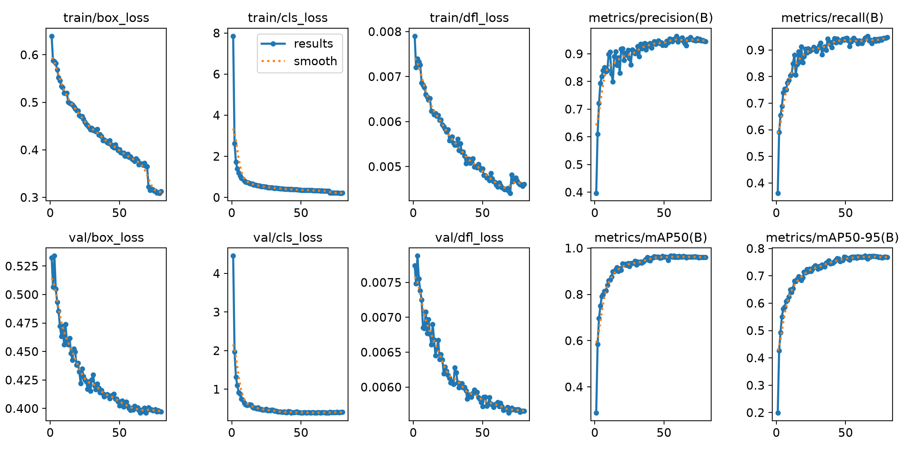
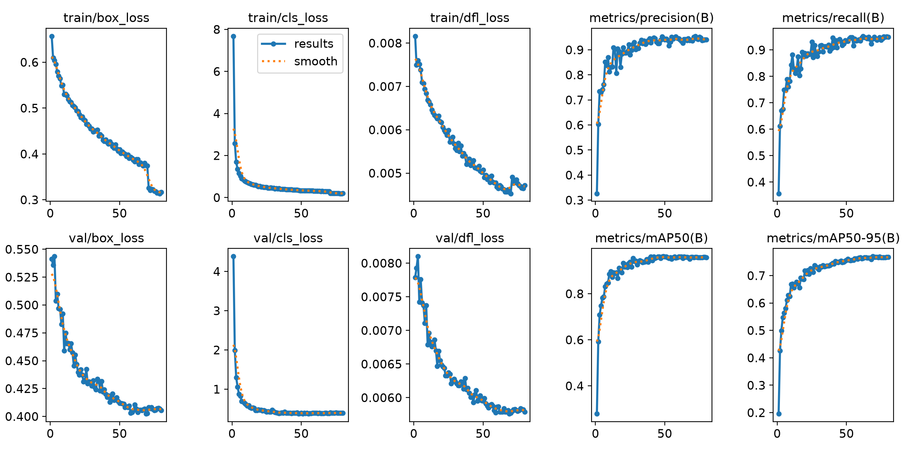
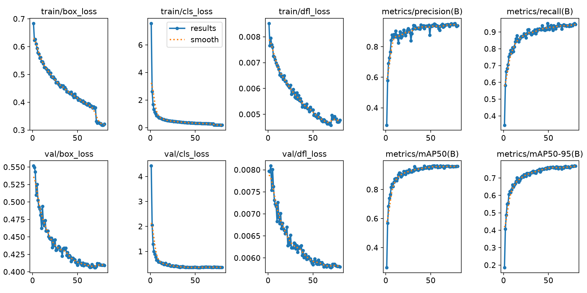

# GCD 混合任务分配与落实实验报告

## 结论

本轮结论是：**继续保留 Baseline，当前完整 GCD Loss + 混合 GCD Assigner 方案不能落实为正式候选。**

seed 42 的中间权重实验表明，`lambda=0.25` 的独立 mAP50-95 为 `0.773385`，相对
Baseline 提升 `+0.003204`；既有 `lambda=1.00` 端点提升 `+0.004273`。这证明 GCD
并非完全没有增益信号。但两者都无法通过预先冻结的源图分组五折双阈值校准：

- `lambda=0.25` 的 fold 0、3、4 在整个双阈值网格内无可行解；
- `lambda=1.00` 的 fold 3 无可行解，已有可行折的舰船阈值又分散在 `0.35` 和 `0.60`；
- `lambda=1.00` 的 fold 2 折外舰船 FDR 达到 `0.301075`，超过单折上限 `0.25`；
- 失败校准没有发布阈值 YAML 或部署配置。

因此没有唯一候选可以冻结，seed 43、44 的四组配对训练按计划中的显式停止条件未启动。
这不是训练中断，而是预注册门槛发挥作用：避免在 seed 42 已经不满足部署约束时继续消耗
GPU，也避免事后放宽门槛挑选结果。

## 实验定义与身份

任务分配器 overlap 定义为：

`S = (1 - lambda) * CIoU + lambda * GCD`

除 Baseline 外，所有 lambda 实验都使用完整 `1-GCD + DFL` 回归损失；只改变 Assigner
中的 `lambda`。YOLO26 one-to-many 与 one-to-one 分支同时使用相同配置。

- 实现提交：`39903fd11a0740ac9cd51d75d6caf042b5b950ea`
- 训练分支：`codex/gcd-blend-repro`
- 固定配置：`yolo26s.pt`、80 epoch、seed 42、imgsz 1024、batch 8、workers 4、AMP 关闭
- 训练环境：Python 3.12.3、PyTorch 2.12.1+cu130、Ultralytics 8.4.71、RTX 3090
- 独立 AP：`conf=0.001`；工程 Recall/FDR：`conf=0.25`
- 校准：5 folds、seed 42、按源图 group 隔离，舰船/非舰船阈值均搜索 `0.250-0.600`，步长 `0.025`

关键输入 SHA-256：

| 输入 | SHA-256 |
|---|---|
| dataset YAML | `6bf4400ec4ab759dbd041d3fa128041205af7ac4868360daf4f5f696763f7b6b` |
| train manifest | `8fc0f7144cb3d922d9a943d531b9172777a52d25fb8e8313e513dfed323f20fe` |
| val manifest | `2ba3156d492ef108a89e55703f341d93a959d17512ac77e72cbd98ab65fe395d` |
| source groups | `ab5ab5fa22f9eb3275f7c23eb111cf83d7db8d47748ba4da14cd32a4a1d7aa3ee` |
| val ground truth | `c66e6fc7b32d77b20e4fdc753acb5a72aa36ddddb0eafd4b09dc0dc7f7e86f33` |
| `yolo26s.pt` | `646f8bc3fe0a656803d95c294f7852321748cb29d13466a1af8862e2db384a1b` |

## seed 42 独立 AP 结果

Baseline 和 lambda 端点复用上一轮相同切分、seed 和训练配置的正式结果；本轮新增
`0.25/0.50/0.75` 三组。AP 进入校准的门槛为相对 Baseline 至少 `+0.002`。

| 方案 | lambda | 最佳 epoch | mAP50 | mAP50-95 | 相对 Baseline | AP 门槛 | 耗时 |
|---|---:|---:|---:|---:|---:|---|---:|
| Baseline | - | 60 | 0.958146 | 0.770181 | +0.000000 | 参考 | 2.36 h |
| GCD-Loss | 0.00 | 69 | 0.964194 | 0.769489 | -0.000692 | 未通过 | 2.37 h |
| GCD-Blend | 0.25 | 64 | 0.965042 | 0.773385 | +0.003204 | **通过** | 2.42 h |
| GCD-Blend | 0.50 | 69 | 0.959341 | 0.770056 | -0.000125 | 未通过 | 2.41 h |
| GCD-Blend | 0.75 | 79 | 0.959471 | 0.769689 | -0.000492 | 未通过 | 2.42 h |
| GCD-Both | 1.00 | 63 | 0.960502 | 0.774454 | +0.004273 | **通过** | 2.37 h |

三组新增训练均正常退出，`results.csv` 各有 80 行；best/last 权重存在、哈希已核验，
训练和验证没有 NaN、Inf、CUDA OOM 或失败重跑。

### 最佳权重哈希

| lambda | best.pt SHA-256 | last.pt SHA-256 |
|---:|---|---|
| 0.25 | `55b498606d49edac54e50bacd2b61ef2e3b96d46cf70abbc30f77a1b39e73f7e` | `9a73f9b06396dffc9d8bbd9adf3965df27b83277a808ecfbad0dc92c1c483c1c` |
| 0.50 | `d09d783f0528e1e0c40c93b4a66d7e996f9f02188df82ad049e4f1a497d50a61` | `994caa9a7e5a038ea43ab2de73f8db3e32c03dce0e914fcca5528b1093ef780f` |
| 0.75 | `0d1abf7ee0951bccfee1957e2869e9f6fff5b6f6a4c74be3474a240029e11831d` | `97d77d844cd28e01acec0d958f0c40c93c23df482daa9042beaa605dbea0751c` |

## 固定阈值 Recall/FDR 与误报来源

| 方案 | lambda | 总体 Recall | 总体 FDR | 舰船 Recall | 舰船 FDR | 舰船 FP（背景/重叠） |
|---|---:|---:|---:|---:|---:|---:|
| Baseline | - | 0.958772 | 0.040037 | 0.800995 | 0.154856 | 59（44/15） |
| GCD-Loss | 0.00 | 0.966832 | 0.042370 | 0.835821 | 0.176471 | 72（58/14） |
| GCD-Blend | 0.25 | 0.966832 | 0.051399 | 0.833333 | 0.182927 | 75（60/15） |
| GCD-Blend | 0.50 | 0.967142 | 0.046163 | 0.838308 | 0.187952 | 78（59/19） |
| GCD-Blend | 0.75 | 0.962492 | 0.049587 | 0.838308 | 0.199525 | 84（67/17） |
| GCD-Both | 1.00 | 0.971482 | 0.049439 | 0.858209 | 0.212329 | 93（75/18） |

最清楚的失败模式不是同一真值附近的重复框，而是舰船背景误报：Baseline 为 44 个，
lambda 从 0 增大到 1 时总体上升到 75 个；重叠型误报只在 14-19 个之间变化。也就是说，
GCD 提高召回的同时，把更多背景区域推入了正样本/高分预测区。单纯提高置信度阈值可以
压低一部分误报，但不同源图折需要的舰船阈值不稳定，因此无法满足冻结部署要求。

### 三个重点细类

| lambda | FSC AP/R/FDR | QHS AP/R/FDR | MS AP/R/FDR |
|---:|---:|---:|---:|
| Baseline | 0.325011/0.743590/0.159420 | 0.524824/0.680412/0.250000 | 0.556963/0.795302/0.177083 |
| 0.00 | 0.331359/0.730769/0.185714 | 0.524947/0.721649/0.213483 | 0.587044/0.838926/0.201278 |
| 0.25 | 0.338801/0.756410/0.157143 | 0.536753/0.711340/0.310000 | 0.588772/0.828859/0.187500 |
| 0.50 | 0.335732/0.782051/0.102941 | 0.546711/0.659794/0.280899 | 0.571733/0.832215/0.222571 |
| 0.75 | 0.299927/0.692308/0.239437 | 0.564380/0.721649/0.230769 | 0.571137/0.835570/0.231481 |
| 1.00 | 0.326869/0.782051/0.140845 | 0.519747/0.701031/0.333333 | 0.574904/0.845638/0.234043 |

中间 lambda 没有形成单调 AP 曲线。`lambda=0.25` 对 FSC、QHS、MS 的 AP 都高于
Baseline，但 QHS 固定阈值 FDR 从 `0.25` 升到 `0.31`；`lambda=0.75` 虽提高 QHS AP，
却显著损害 FSC。GCD 的收益和误报代价都具有类别依赖性，不能靠一个 Assigner 权重稳定兼顾。

## 五折 ship-override 校准

每折在另外四折上同时搜索舰船阈值与非舰船阈值。折内候选必须满足相对 Baseline 的
Recall/FDR 门槛，并满足舰船 Recall >= 0.80、舰船 FDR <= 0.17。任何折无解即失败，
不再用不完整折计算或发布中位数阈值。

### lambda=0.25

| Fold | 舰船阈值 | 非舰船阈值 | 合格组合数 | 折外整体 R/FDR | 折外舰船 R/FDR |
|---:|---:|---:|---:|---:|---:|
| 0 | - | - | 0 | - | - |
| 1 | 0.325 | 0.375 | 41 | 0.972050/0.030960 | 0.812500/0.197531 |
| 2 | 0.325 | 0.375 | 40 | 0.946809/0.054628 | 0.797468/0.258824 |
| 3 | - | - | 0 | - | - |
| 4 | - | - | 0 | - | - |

fold 0、3、4 无任何双阈值组合能同时满足折内门槛，校准直接失败；已有折的折外舰船 FDR
也分别达到 `0.197531` 和 `0.258824`，没有显示出足够的泛化余量。

### lambda=1.00

| Fold | 舰船阈值 | 非舰船阈值 | 合格组合数 | 折外整体 R/FDR | 折外舰船 R/FDR |
|---:|---:|---:|---:|---:|---:|
| 0 | 0.600 | 0.425 | 11 | 0.948678/0.033281 | 0.777778/0.100000 |
| 1 | 0.600 | 0.425 | 25 | 0.972050/0.026439 | 0.800000/0.146667 |
| 2 | 0.350 | 0.400 | 177 | 0.958967/0.063798 | 0.822785/0.301075 |
| 3 | - | - | 0 | - | - |
| 4 | 0.600 | 0.425 | 74 | 0.968944/0.023474 | 0.795181/0.164557 |

fold 3 无解；其余折的舰船阈值原始极差已经是 `0.25`，远高于允许的 `0.05`。fold 2
需要明显更低的舰船阈值，折外舰船 FDR 随即升至 `0.301075`；fold 0、4 在高阈值下又
未达到 0.80 的折外舰船 Recall。这说明不是“再找一个更好的全局阈值”就能解决，而是
不同源图子分布上的置信度排序本身不稳定。

## 验收与停止条件

| 阶段 | 要求 | 结果 |
|---|---|---|
| 新增 lambda AP | 相对 Baseline mAP50-95 >= +0.002 | 仅 0.25 通过；0.50/0.75 失败 |
| 端点参考 AP | 同一 AP 门槛 | 1.00 通过；0.00 失败 |
| lambda=0.25 五折校准 | 每折均有可行双阈值并通过 OOF 门槛 | 失败，3 折无解 |
| lambda=1.00 五折校准 | 每折均有可行双阈值并通过 OOF 门槛 | 失败，1 折无解且阈值不稳定 |
| 唯一候选冻结 | AP 与校准同时通过 | 无候选 |
| seed 43/44 配对复现 | 仅候选冻结后启动 | **未启动（计划内停止）** |
| GCD 最终落实 | 多种子 AP 与冻结阈值门槛全部通过 | **未通过** |

由于没有候选，多种子均值、标准差和跨 seed 正增益数均为 `not run`，不能用 seed 42
的单次 AP 增益宣称 GCD 已经稳定复现。

## 产物与完整性

- 新增三组 run name：`gcd-blend-s42-a025`、`gcd-blend-s42-a050`、`gcd-blend-s42-a075`。
- 每组均保留独立 best/last checkpoint、80 轮结果和完整远端日志；这些运行产物不进入 Git。
- Git 只包含脱敏聚合 JSON/CSV、训练曲线、PR 曲线和本报告；不包含权重、全量预测、日志、图像 ID、源图名称、主机信息或凭据。
- 两个失败校准退出码均为 `2`，且均未生成 `calibrated-thresholds.yaml` 或部署配置。
- 结构化摘要见 [summary.json](assets/gcd-blend-repro-20260717/summary.json)。
- 六个 lambda 的聚合表见 [lambda-results.csv](assets/gcd-blend-repro-20260717/lambda-results.csv)。
- 五折诊断见 [calibration-folds.csv](assets/gcd-blend-repro-20260717/calibration-folds.csv)。
- 逐轮训练 CSV：[0.25](assets/gcd-blend-repro-20260717/lambda-025-training-results.csv)、
  [0.50](assets/gcd-blend-repro-20260717/lambda-050-training-results.csv)、
  [0.75](assets/gcd-blend-repro-20260717/lambda-075-training-results.csv)。
- 独立验证 PR 曲线：[0.25](assets/gcd-blend-repro-20260717/lambda-025-box-pr-curve.png)、
  [0.50](assets/gcd-blend-repro-20260717/lambda-050-box-pr-curve.png)、
  [0.75](assets/gcd-blend-repro-20260717/lambda-075-box-pr-curve.png)。

## 推荐

正式模型继续使用 Baseline。本轮已经回答了“调 Assigner 中 GCD 占比能否落实”：
`lambda=0.25` 有 AP 信号，但完整 GCD Loss 下的舰船背景误报和跨源图阈值不稳定仍然
阻止部署。若另立下一轮，应更换训练假设，例如混合回归损失或显式困难负样本，而不是
继续细调 lambda 或事后放宽本轮阈值门槛。

