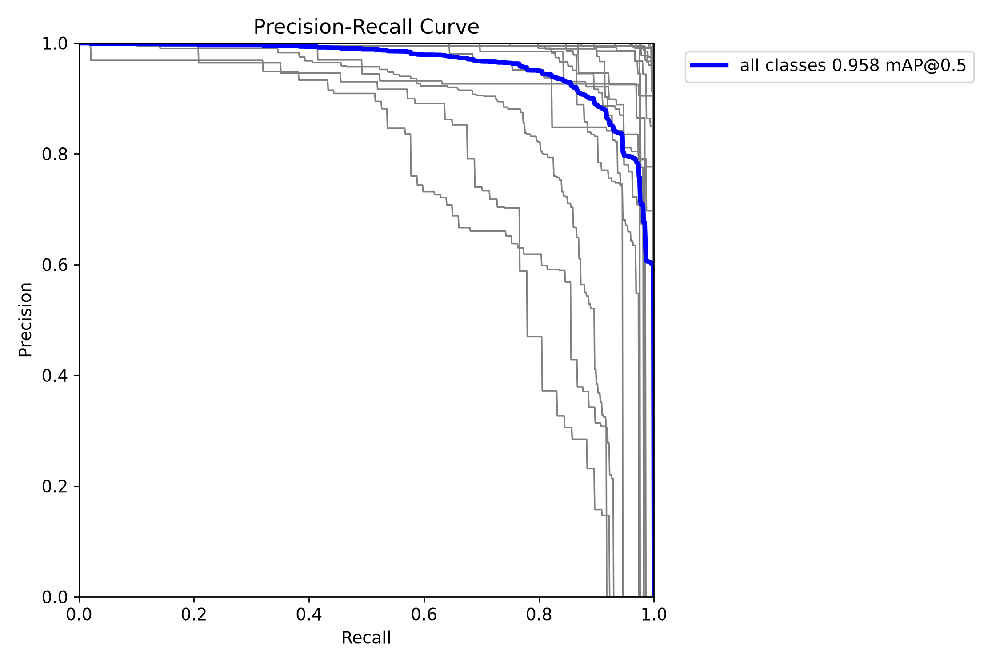
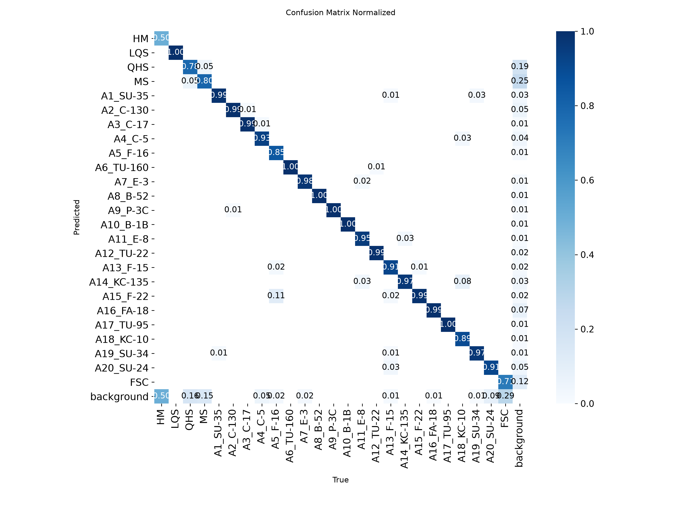
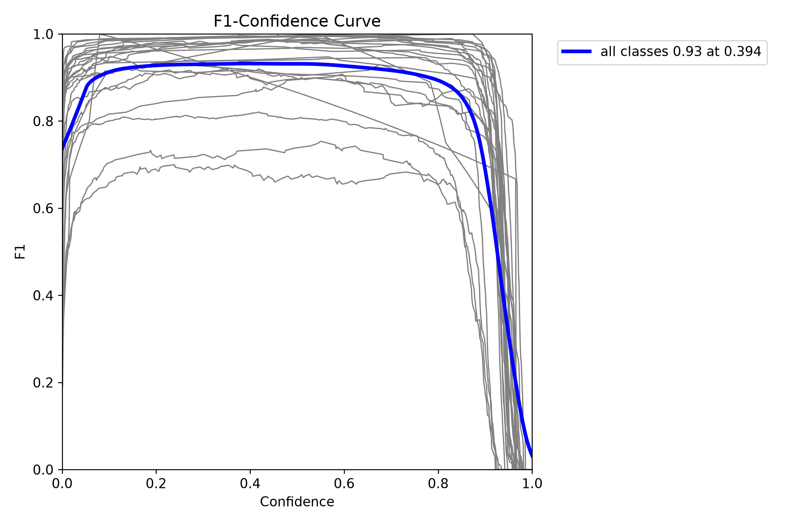
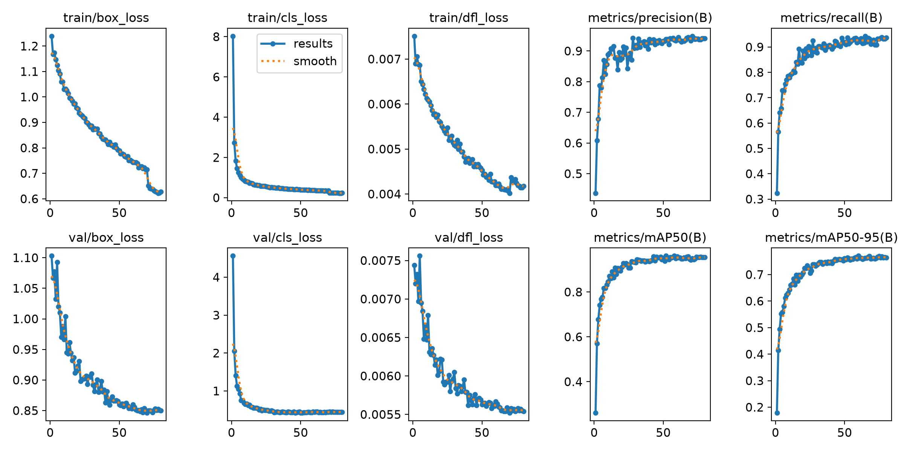

# XH-202625 YOLO26s 80 Epoch 验证结果报告

- 报告生成时间：2026-07-16T00:04:19+08:00
- 实验：`xh25-yolo26s-e80-20260715-best-val`
- 代码提交：`a2a53614eb83a7144f7befdc7abf4c7f8c5c3bc4`
- 模型 SHA-256：`e5c6e464fc47c048b3d8573b69c5069f743ad2d042ad353b687b07dc68251853`
- 验证集：固定 XH25 `val` 切分，674 张图，25 类，标准 AP 口径有效标注 3,225 个

## 结论摘要

- **mAP@0.5：0.9581（95.81%）**
- **mAP@0.5:0.95：0.7702（77.02%）**
- Precision：0.9390；Recall：0.9296
- 固定阈值 0.25 的工程评估：总体 Recall 0.9588，FDR 0.0400，仓库代理判定 `pass_candidate`。
- 独立验证和训练阶段最佳轮次（Epoch 60)的 mAP50-95 仅相差 -0.000139，结果可复现且一致。

可以向老师直接汇报：**“目前有 AP 结果：固定验证集上 mAP@0.5 为 95.81%，mAP@0.5:0.95 为 77.02%。”**

## 标准 AP 验证

| 指标 | 独立验证 | 训练阶段最佳轮次 | 差值 |
|---|---:|---:|---:|
| Precision | 0.939039 | 0.939070 | -0.000031 |
| Recall | 0.929582 | 0.929910 | -0.000328 |
| mAP@0.5 | 0.958146 | 0.958210 | -0.000064 |
| mAP@0.5:0.95 | 0.770181 | 0.770320 | -0.000139 |

标准验证总耗时 8.10 秒；模型纯推理速度 5.90 ms/图。

### 三大类 AP 宏平均

| 类别组 | 细分类数 | 实例数 | Precision | Recall | mAP@0.5 | mAP@0.5:0.95 |
|---|---:|---:|---:|---:|---:|---:|
| 舰船（HM/LQS/QHS/MS） | 4 | 402 | 0.8660 | 0.8288 | 0.8955 | 0.6825 |
| 飞机（20 类） | 20 | 2746 | 0.9614 | 0.9618 | 0.9805 | 0.8100 |
| 车辆（FSC） | 1 | 77 | 0.7836 | 0.6883 | 0.7610 | 0.3250 |

### 分类别 AP

| ID | 类别 | 实例数 | Precision | Recall | AP50 | AP75 | AP50-95 |
|---:|---|---:|---:|---:|---:|---:|---:|
| 0 | HM | 2 | 1.0000 | 0.8226 | 0.9950 | 0.8283 | 0.7783 |
| 1 | LQS | 5 | 0.9450 | 1.0000 | 0.9950 | 0.9950 | 0.8700 |
| 2 | QHS | 97 | 0.6539 | 0.7207 | 0.7496 | 0.6533 | 0.5248 |
| 3 | MS | 298 | 0.8652 | 0.7718 | 0.8423 | 0.6349 | 0.5570 |
| 4 | A1_SU-35 | 209 | 0.9727 | 0.9952 | 0.9905 | 0.9794 | 0.8514 |
| 5 | A2_C-130 | 192 | 0.9716 | 1.0000 | 0.9945 | 0.9932 | 0.8077 |
| 6 | A3_C-17 | 153 | 0.9854 | 1.0000 | 0.9950 | 0.9936 | 0.8375 |
| 7 | A4_C-5 | 76 | 0.9300 | 0.8816 | 0.9738 | 0.9738 | 0.8501 |
| 8 | A5_F-16 | 164 | 1.0000 | 0.8425 | 0.9292 | 0.8130 | 0.6713 |
| 9 | A6_TU-160 | 50 | 0.9833 | 1.0000 | 0.9950 | 0.9950 | 0.8528 |
| 10 | A7_E-3 | 83 | 0.9861 | 0.9759 | 0.9750 | 0.9750 | 0.8374 |
| 11 | A8_B-52 | 110 | 0.9851 | 1.0000 | 0.9950 | 0.9950 | 0.8466 |
| 12 | A9_P-3C | 133 | 0.9925 | 0.9989 | 0.9948 | 0.9941 | 0.7910 |
| 13 | A10_B-1B | 111 | 0.9922 | 0.9910 | 0.9950 | 0.9936 | 0.8369 |
| 14 | A11_E-8 | 65 | 0.9126 | 0.9692 | 0.9464 | 0.9464 | 0.8326 |
| 15 | A12_TU-22 | 88 | 0.9871 | 0.9773 | 0.9944 | 0.9223 | 0.8227 |
| 16 | A13_F-15 | 222 | 0.9780 | 0.9009 | 0.9578 | 0.9415 | 0.7454 |
| 17 | A14_KC-135 | 211 | 0.9584 | 0.9716 | 0.9802 | 0.9802 | 0.8098 |
| 18 | A15_F-22 | 73 | 0.7636 | 1.0000 | 0.9604 | 0.9020 | 0.7440 |
| 19 | A16_FA-18 | 316 | 0.9761 | 0.9842 | 0.9945 | 0.9887 | 0.7956 |
| 20 | A17_TU-95 | 165 | 0.9884 | 1.0000 | 0.9950 | 0.9685 | 0.8601 |
| 21 | A18_KC-10 | 38 | 0.9443 | 0.8926 | 0.9861 | 0.9861 | 0.8282 |
| 22 | A19_SU-34 | 153 | 0.9866 | 0.9598 | 0.9923 | 0.9066 | 0.7553 |
| 23 | A20_SU-24 | 134 | 0.9343 | 0.8955 | 0.9659 | 0.9410 | 0.8231 |
| 24 | FSC | 77 | 0.7836 | 0.6883 | 0.7610 | 0.2476 | 0.3250 |

## 固定阈值 Recall/FDR 工程评估

该评估使用仓库推理管线、类别阈值 0.25，并采用项目内置匹配规则；它用于 Demo 和比赛代理诊断，不替代 COCO 风格 AP。

| 粗类别 | TP | FP | FN | Recall | FDR |
|---|---:|---:|---:|---:|---:|
| 飞机 | 2713 | 59 | 33 | 0.9880 | 0.0213 |
| 舰船 | 322 | 59 | 80 | 0.8010 | 0.1549 |
| 车辆 | 58 | 11 | 20 | 0.7436 | 0.1594 |
| 总体（类别无关匹配） | 3093 | 129 | 133 | 0.9588 | 0.0400 |

- 输出预测框：3,222 个。
- 内置硬门槛：总体 Recall ≥ 0.85、总体 FDR ≤ 0.20；本次两项均通过。
- 延迟硬门槛本次未填写，因此代理报告未对时效性作通过/失败判断。

## 结果分析

- 飞机是当前模型的优势类别：固定阈值下 Recall 98.80%、FDR 2.13%，20 个飞机细类的 AP50-95 宏平均也明显高于舰船和车辆。
- 舰船仍是主要短板：QHS、MS 的定位与召回偏弱；固定阈值下舰船 Recall 80.10%、FDR 15.49%。
- 车辆 FSC 是最弱细类，AP50-95 仅 0.325，固定阈值 Recall 74.36%、FDR 15.94%，应作为下一轮训练和阈值优化重点。
- HM 仅 2 个实例、LQS 仅 5 个实例，单类 AP 波动很大，不能据此判断泛化能力。

AP50-95 最低的五类：FSC 0.325、QHS 0.525、MS 0.557、A5_F-16 0.671、A15_F-22 0.744。

AP50-95 最高的五类：LQS 0.870、A17_TU-95 0.860、A6_TU-160 0.853、A1_SU-35 0.851、A4_C-5 0.850。

## 风险与口径说明

- 这些结果来自内部固定验证集，不是比赛测试集或官方排行榜成绩。
- Ultralytics 在 FSC 验证标签中自动移除了 1 个重复标注，因此 AP 使用 3,225 个有效实例；项目 COCO 真值仍含 3,226 条标注，Recall/FDR 分母与 AP 略有差异。
- 标准 AP 验证使用 `conf=0.001` 计算完整 PR 曲线；固定阈值工程评估使用 `conf=0.25`，两套 Precision/Recall 不应直接横向替代。
- 总体 Recall/FDR 是项目定义的类别无关匹配；正式比较模型时应同时看分类别 AP、粗类别指标和官方规则。

## 下一步建议

1. 针对 FSC、QHS、MS 做误检/漏检可视化和样本审计。
2. 在不改验证切分的前提下做分类别阈值搜索，重点压低舰船与车辆 FDR。
3. 尝试类别重采样、难例训练或更高分辨率实验，并以本报告作为对照基线。
4. 最终提交前按官方评测脚本和测试集格式再验收一次。

## 复现信息与产物

- 底模：`yolo26s.pt`；训练 80 epoch；输入尺寸 1024；batch 8；AMP 关闭。
- 运行环境：Python 3.12.3，PyTorch 2.12.1+cu130，Ultralytics 8.4.71，GPU NVIDIA GeForce RTX 3090。
- [`ap-validation-metrics.json`](assets/xh25-yolo26s-e80-20260715/ap-validation-metrics.json)：脱敏后的完整 AP 与逐 IoU 阈值结果。
- [`per-class-ap.csv`](assets/xh25-yolo26s-e80-20260715/per-class-ap.csv)：25 类指标表。
- [`recall-fdr-summary.json`](assets/xh25-yolo26s-e80-20260715/recall-fdr-summary.json)：不含逐图信息的固定阈值 Recall/FDR 摘要。
- [`competition-proxy.json`](assets/xh25-yolo26s-e80-20260715/competition-proxy.json)：内置比赛代理结果。
- [`training-results.csv`](assets/xh25-yolo26s-e80-20260715/training-results.csv) 和 [`training-results.png`](assets/xh25-yolo26s-e80-20260715/training-results.png)：逐 epoch 指标与训练曲线。
- 曲线图仅包含聚合指标；模型权重、全量预测、逐图结果、日志和验证样例不进入 Git。

