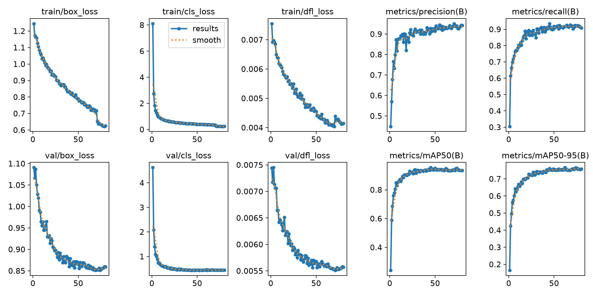
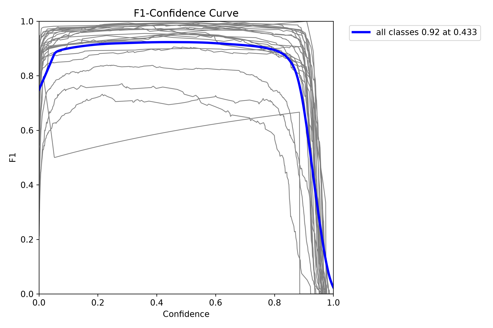
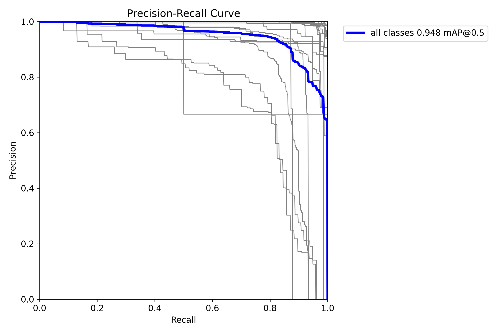
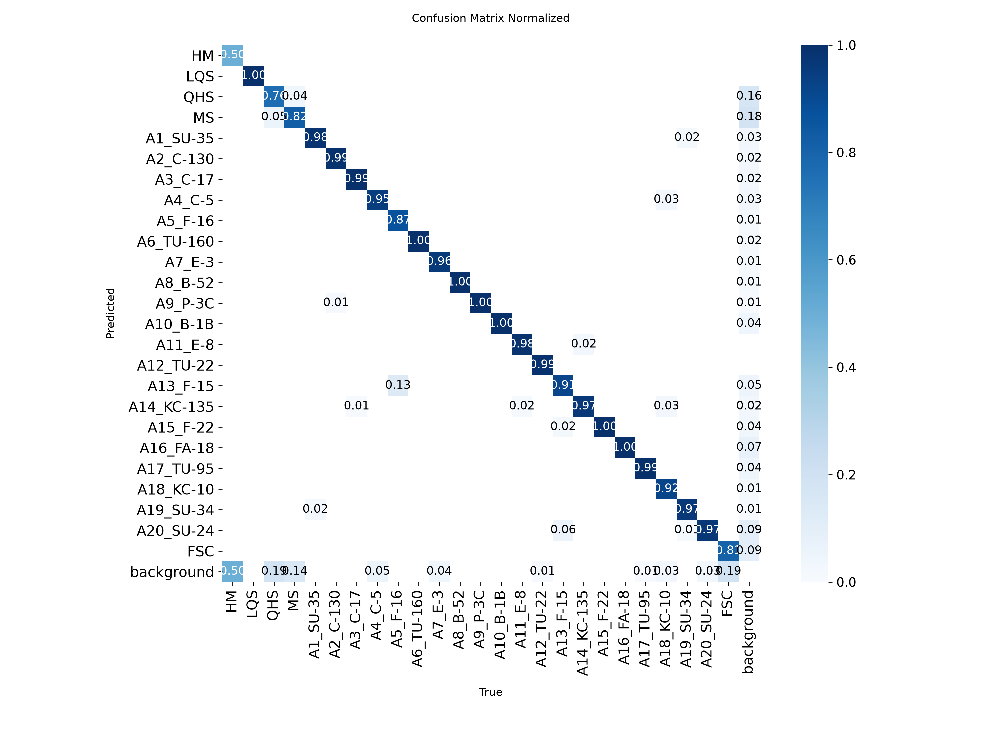

# XH25 YOLO26s 80 Epoch 训练复现记录

## 1. 实验摘要

本记录对应正式 XH25 25 类 HBB 检测实验 `xh25-yolo26s-e80`。实验使用
`yolo26s.pt` 预训练权重，在固定的 3,807/674 train/val 划分上训练 80 epochs，
最终以 `best.pt` 作为推理和 Gradio Demo 权重。

主要结论：

- `best.pt` 在 Ultralytics 验证中达到 Precision 0.932、Recall 0.918、
  mAP50 0.948、mAP50-95 0.766；
- 项目自定义评估器在置信度阈值 0.25 下达到整体 Recall 0.961562、
  FDR 0.037244；
- 飞机检测已经较强，主要瓶颈集中在舰船 QHS/MS、车辆 FSC，以及少量飞机细分类；
- 记录的阈值扫描中，0.25 获得最高整体 F1 0.962159。

Ultralytics mAP 与项目自定义 Recall/FDR 使用不同匹配和聚合方式，下文分别记录，
不能把两组数值直接视为同一指标。

## 2. 代码与环境

| 项目 | 值 |
| --- | --- |
| 训练代码 commit | `3254a6aa8377a88124a73bfe627176cdd3502255` |
| 任务 | XH25 25 类 HBB，`task: detect` |
| GPU | NVIDIA GeForce RTX 4090，24 GiB |
| Python | 3.12.3 |
| PyTorch | 2.12.1+cu130 |
| Ultralytics | 8.4.71 |
| 模型规模 | YOLO26s，122 层、9,474,855 参数、20.6 GFLOPs |
| 训练时长 | 1.790 小时 |
| 观察到的峰值显存 | 约 12.4 GiB |

训练配置的仓库版本见
[`configs/xh25-yolo26s-e80.yaml`](../../configs/xh25-yolo26s-e80.yaml)，
脱敏训练参数见
[`training-args.yaml`](assets/xh25-yolo26s-e80/training-args.yaml)。

## 3. 数据集与划分

| 项目 | 数值 |
| --- | ---: |
| 原始图像-标签对 | 4,481 |
| train 图像 | 3,807 |
| val 图像 | 674 |
| val 目标实例 | 3,225 |
| 细分类别 | 25 |

数据准备使用固定 seed 42，并按源图分组切分，避免同源裁剪跨 train/val 泄漏。详细
数据分析见 [`docs/xh25-data-analysis.md`](../xh25-data-analysis.md)。

用于确认相同划分的 SHA256：

| 文件 | SHA256 |
| --- | --- |
| `datasets/xh25/manifests/train.txt` | `8fc0f7144cb3d922d9a943d531b9172777a52d25fb8e8313e513dfed323f20fe` |
| `datasets/xh25/manifests/val.txt` | `2ba3156d492ef108a89e55703f341d93a959d17512ac77e72cbd98ab65fe395d` |
| `datasets/xh25/manifests/source-groups.json` | `ab5ab5fa22f9eb3275f7c23eb111cf83d7db8d47748ba4da14cd32a4a1d7a3ee` |

只有在以上哈希一致时，逐 epoch 指标才具备直接可比性。

## 4. 训练命令与关键参数

```bash
.venv/bin/xh-detect train \
  --dataset-yaml datasets/xh25/dataset.yaml \
  --model yolo26s.pt \
  --epochs 80 \
  --image-size 1024 \
  --device 0 \
  --batch 8 \
  --workers 4 \
  --no-amp \
  --project runs/train \
  --name xh25-yolo26s-e80 \
  --no-resume
```

关键行为：

- `pretrained=true`，从 `yolo26s.pt` 迁移 696/708 个参数项；
- `seed=42`、`deterministic=true`；
- `optimizer=auto` 最终解析为 AdamW，学习率 0.000345、momentum 0.9、
  weight decay 0.0005；
- AMP 关闭，输入尺寸 1024，batch 8，4 个 dataloader workers；
- mosaic 在最后 10 epochs 关闭；
- 每个 epoch 执行验证，保存 `best.pt` 和 `last.pt`。

## 5. 产物哈希

| 产物 | SHA256 |
| --- | --- |
| 底模 `yolo26s.pt` | `646f8bc3fe0a656803d95c294f7852321748cb29d13466a1af8862e2db384a1b` |
| `best.pt` | `930cf7e1c698a8850523ce42d2565d1b2652e5ae01bf7f049a35d05778dd5424` |
| `last.pt` | `584e40ad59adb32d2f363f81ce935fc644d8983f4374b2a37a68e8a66f47991d` |
| 原始 `results.csv` | `0fe812216ae3959c6a564969e5e758f21f26c85f175164c402bd4d98fff4fe4e` |
| 原始 `results.png` | `da1b09da99eb5b1e0fd7d9380c738dbfa12ae7f24cb911ab4eb742f701a0ce24` |

权重文件不进入 Git。复现后应使用 `sha256sum` 或 `Get-FileHash` 对照本表。

## 6. Ultralytics 验证结果

### 6.1 最佳权重与训练趋势

| 视图 | Epoch | Precision | Recall | mAP50 | mAP50-95 |
| --- | ---: | ---: | ---: | ---: | ---: |
| `best.pt` 最终验证 | — | 0.932 | 0.918 | 0.948 | 0.766 |
| CSV 最高 Precision | 71 | 0.95098 | — | — | — |
| CSV 最高 Recall | 45 | — | 0.93472 | — | — |
| CSV 最高 mAP50 | 45 | — | — | 0.95486 | — |
| CSV 最高 mAP50-95 | 62 | — | — | — | 0.76610 |
| 最后一个 epoch | 80 | 0.94218 | 0.90883 | 0.93559 | 0.75819 |

最后 10 epochs 的平均 mAP50-95 为 0.758815。mAP50-95 在约 epoch 62 达到峰值后
进入平台期，继续增加 epoch 的边际收益有限。`best.pt` 会重新执行一次完整验证，
因此其汇总值与 `results.csv` 某一行可能存在轻微差异。

最佳权重的单图平均速度：

- preprocess：0.3 ms；
- inference：3.7 ms；
- postprocess：0.1 ms。

以上速度来自 674 张、3,225 个实例的验证过程，不代表 10,000×10,000 大图滑窗总耗时。

逐 epoch 原始指标：
[`results.csv`](assets/xh25-yolo26s-e80/results.csv)



### 6.2 类别级观察

`best.pt` 验证中较弱的 mAP50-95：

| 类别 | mAP50-95 | 说明 |
| --- | ---: | --- |
| FSC | 0.301 | 车辆小目标，是当前最明显短板 |
| QHS | 0.545 | 舰船类，漏检和误检均偏高 |
| MS | 0.568 | 舰船类，背景误检明显 |
| A5_F-16 | 0.634 | Recall 低于大多数飞机类别 |
| A13_F-15 | 0.716 | 类间混淆和漏检仍有空间 |

HM 的 mAP50-95 为 0.795，但验证集只有两个实例，不能据此判断泛化能力。







## 7. 项目自定义评估器

以下结果使用统一置信度阈值 0.25，并按项目比赛诊断逻辑进行一对一匹配。

| 聚合类别 | TP | FP | FN | Recall | FDR |
| --- | ---: | ---: | ---: | ---: | ---: |
| Overall | 3,102 | 120 | 124 | 0.961562 | 0.037244 |
| Aircraft | 2,716 | 44 | 30 | 0.989075 | 0.015942 |
| Ship | 331 | 62 | 71 | 0.823383 | 0.157761 |
| Vehicle | 55 | 14 | 23 | 0.705128 | 0.202899 |

飞机已经接近饱和；舰船和车辆同时存在漏检与误检问题，应优先分配数据分析和训练资源。

### 7.1 低 Recall 类别

| 类别 | GT | Recall | FDR |
| --- | ---: | ---: | ---: |
| HM | 2 | 0.5000 | 0.0000 |
| QHS | 97 | 0.6907 | 0.2209 |
| FSC | 78 | 0.7051 | 0.2029 |
| A5_F-16 | 164 | 0.7988 | 0.0076 |
| MS | 298 | 0.8255 | 0.1827 |
| A18_KC-10 | 38 | 0.8421 | 0.0000 |
| A13_F-15 | 222 | 0.9144 | 0.1362 |
| A20_SU-24 | 134 | 0.9179 | 0.1214 |

HM 样本过少，应单独检查而不是围绕单次指标调参。QHS、MS 和 FSC 具有足够样本量，
是下一轮错误分析和数据增强的主要对象。

## 8. 阈值扫描

| Threshold | Precision | Recall | FDR | F1 |
| ---: | ---: | ---: | ---: | ---: |
| 0.05 | 0.909538 | 0.975511 | 0.090462 | 0.941370 |
| 0.10 | 0.933274 | 0.971172 | 0.066726 | 0.951846 |
| 0.20 | 0.955173 | 0.964352 | 0.044827 | 0.959741 |
| 0.25 | 0.962756 | 0.961562 | 0.037244 | 0.962159 |
| 0.30 | 0.965927 | 0.957843 | 0.034073 | 0.961868 |
| 0.40 | 0.972655 | 0.948233 | 0.027345 | 0.960289 |

记录的 0.05–0.95 扫描中，0.25 获得最高整体 F1。建议：

- 0.25：平衡 Demo 和自定义评估器的默认选择；
- 0.20：需要更少漏检时使用，但 FDR 略升；
- 0.40：展示时希望框更干净可使用，但 Recall 会下降。

阈值扫描不改变模型 mAP，也不能代替训练和数据改进。

## 9. Demo 验收

同一 `best.pt` 在 Gradio 前端完成三类代表性样例验收：

| 样例类别 | 预测数量 | 备注 |
| --- | ---: | --- |
| 飞机 | 22 | 22 个 A2_C-130 |
| 舰船 | 8 | 1 个 LQS、7 个 QHS |
| 车辆 | 9 | 9 个 FSC |

样例用于确认前端、绘图和 JSON 导出链路，不作为模型精度统计。

## 10. 复现步骤

1. 使用与本记录相同版本代码：

   ```bash
   git checkout 3254a6aa8377a88124a73bfe627176cdd3502255
   ```

2. 按 [`README.md`](../../README.md) 准备 Python/CUDA 环境。
3. 将正式数据放入被 Git 忽略的 `data/`，执行：

   ```bash
   .venv/bin/xh-detect prepare-xh25 \
     --source-root data \
     --output-root datasets/xh25 \
     --val-ratio 0.15 \
     --seed 42
   ```

4. 对比第 3 节的三个 manifest SHA256；不一致时不要直接比较训练结果。
5. 确认底模 SHA256 后，运行第 4 节训练命令。
6. 训练结束后比较 `best.pt`、`last.pt`、`results.csv` 和 `results.png` 哈希。
7. 将 `configs/xh25-yolo26s-e80.yaml` 的模型路径指向复现出的 `best.pt`，再执行
   `infer-dataset`、`evaluate` 和 `sweep-thresholds`。

## 11. 未提交产物

为控制仓库体积并保护比赛数据，以下内容不进入 Git：

- `best.pt`、`last.pt` 和底模；
- 原始训练日志；
- 全量预测与逐图评估 JSON；
- 数据集、标签、train/val batch 图和预测样例；
- SSH 密钥、服务器地址、密码、token 和临时端口。

如需共享权重，应使用私有 Release 或受控对象存储，并同时提供 SHA256。

## 12. 下一轮实验建议

1. 为 QHS、MS 和 FSC 生成漏检、误检与低置信度样本清单；
2. 对舰船和车辆做困难样本裁剪、类别均衡和小目标增强；
3. 保持同一 split，分别对 1280/1536 输入尺寸做单变量实验；
4. 评估切片尺度、overlap 和 merge IoU 对舰船/车辆的影响；
5. 每轮只改变一个主要因素，并使用本记录的指标表作为基线。
